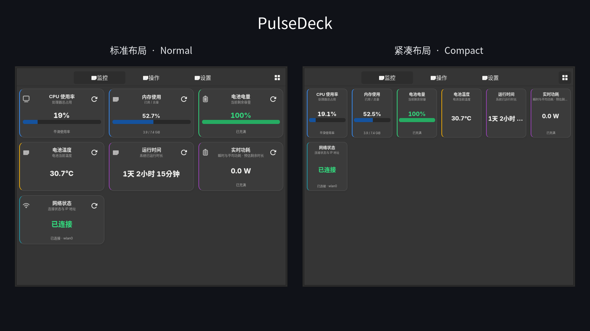
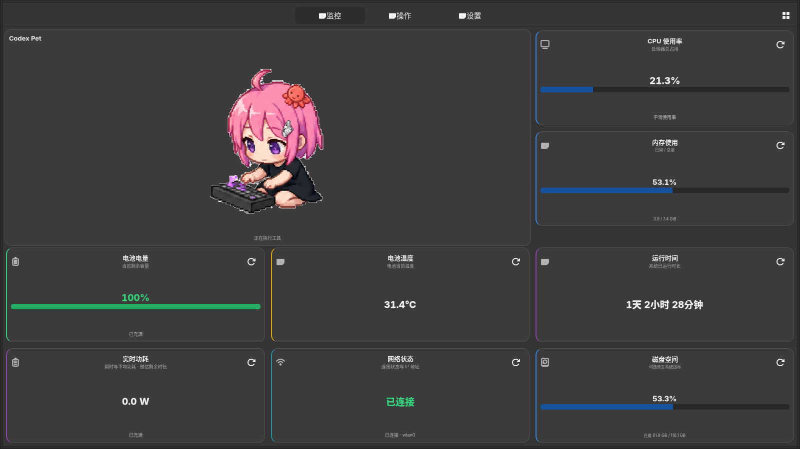

# PulseDeck

简体中文 | [English](README.md)

PulseDeck 是面向 Linux 手机、平板和桌面的轻量 GTK4/Libadwaita 配置化仪表盘。
页面、指标卡片、刷新计划、解析器和操作均可用 TOML 或 JSON 描述，因此大多数界面
调整无需重新编译应用。



_未启用任何可选 Cargo feature 的暗色默认构建：左侧为标准布局，右侧为紧凑布局。_

## 功能

- 原生支持 CPU、内存、电池、功耗、网络、运行时间、文件系统、进程数、负载、
  交换空间、温度及网络吞吐指标。
- 支持内置指标、文件、命令、HTTP 和静态值数据源。
- 支持数值、进度、状态、文本、列表、组合和操作渲染器。
- 普通卡片支持有序视觉状态规则，可按数值、文本或数据源状态匹配，并覆盖文案、图标、
  分区颜色、多色背景和不增加定时器的颜色过渡。
- 主数值统一使用直观格式：整百分比不显示无意义小数，单位自然排版，网络卡优先显示
  IP，功耗卡优先显示功率。
- 支持固定间隔或 `daily@08:00,20:00` 等时间计划，并按时间槽缓存。
- 全局及单卡片响应式尺寸，适配移动端和桌面布局。
- 页面不可见时停止轮询。
- 统一管理前台正常、空闲省电、外接供电、后台及 Codex 事件唤醒状态，设置即时生效。
- 文件和网络状态事件驱动更新，临近刷新合并唤醒，共享系统快照并去重持久缓存写入。
- 限制子进程输出、HTTP 响应大小和执行时间。
- 可选、独立编译的 ScrcpyForge 设备控制页面。
- 可选、独立编译的 Codex/OpenCode/pi PetCard，支持事件驱动生命周期动画、展示尺寸
  记忆和完成提示音。
- 页面工具栏可在配置的普通网格与六列紧凑网格间切换，并跨启动记忆上次选择。

## 运行与低功耗模式

PulseDeck 使用一套由普通卡片与可选插件共享的事件驱动运行管理器。只有点击、触摸、
按键、滚动、切换页面和手动刷新等真实输入会重置用户空闲时间；自动刷新、动画、文件
事件和网络响应都不会重置。
多个条件同时满足时，优先级依次为：后台、外接电源、Agent 重要事件提醒、新任务保护、
稳定空闲、前台正常。

| 模式 | 进入条件 | 显示与工作策略 |
| --- | --- | --- |
| 前台正常 | 窗口已映射，且没有更高优先级模式。 | 使用卡片原始计划、正常动画速率和完整插件展示。 |
| 空闲省电 | 超过 `idle_timeout_seconds` 无真实输入，再经过 `idle_stability_seconds` 稳定期。 | 按卡片成本降低刷新频率，PetCard 降至 1 FPS，ScrcpyForge 只取元数据而不取预览帧。`dim` 或适合 OLED 的 `minimal` 遮罩只影响 PulseDeck，不会修改系统亮度。 |
| 外接电源实时 | 电源上报在线，且启用 `external_realtime`。 | 符合策略的卡片可提高刷新频率，外接电源也可阻止进入空闲。命令和 HTTP 卡片除非单独选择加入，否则保持原始间隔。PulseDeck 不修改 CPU governor。 |
| Agent 保护／提醒 | 新 Agent 任务开始，或出现独立的完成、失败、取消、等待输入、等待确认或异常中止事件。 | 新任务只在最初的保护截止时间前保持正常视觉亮度，等待不会延长时间。重要事件可播放一次提示音，并在配置的提醒时段内恢复正常显示与刷新策略。 |
| 后台 | 应用窗口取消映射。 | 释放屏幕抑制，暂停普通卡片工作，移除 PetCard 帧定时器，并停止 ScrcpyForge 预览；固定生命周期监听和已配置通知仍可用。 |

温热及更高等级的热状态只会降低昂贵的插件展示工作，不会改变外接电源判定：
ScrcpyForge 会降低预览与健康检查频率，设备过热或发生节流时 PetCard 会冻结在当前帧。
任何真实输入都会立即恢复前台界面。

## 页面布局模式

页面工具栏右侧的网格按钮控制通用指标卡和操作卡布局：

| 布局 | 行为 |
| --- | --- |
| 普通 | 使用 `[ui].card_columns`（默认三列）；卡片宽度均分整行，高度按页面可见区自适应为三行。 |
| 紧凑 | 将指标卡与操作卡重排为六列，同时仍以三行填满可见区，并使用更紧凑的间距、字号和控件。 |

工具栏选择保存在
`${XDG_STATE_HOME:-$HOME/.local/state}/pulsedeck/compact-grid`，下次启动时自动恢复。
这是页面网格偏好，不是 PetCard 专属尺寸。切换网格会立即重排已经放大的 PetCard；
PetCard 自己的普通、占四格、占六格和全屏偏好见下文。全局与单卡片
`card_height` 仍作为小窗口或特意加高卡片的最小高度，显式宽度配置也继续有效。

## 环境要求

- 安装 GTK 4.10 或更高版本、Libadwaita 1.2 或更高版本的 Linux。
- Rust stable 及 GTK Rust 绑定所需的本机构建依赖。
- 自定义配置所引用的可选命令或服务。

Debian 系发行版常用开发包名称为 `libgtk-4-dev`、`libadwaita-1-dev`、
`pkg-config` 和 `build-essential`；其他发行版的软件包名称可能不同。

## 构建与运行

```sh
git clone https://github.com/xiangwan-cn/PulseDeck.git
cd PulseDeck
cargo build --release
./target/release/pulsedeck
```

如需包含可选 ScrcpyForge 页面：

```sh
cargo build --release --features scrcpy-forge
```

如需包含 PetCard，或同时包含两个可选集成：

```sh
cargo build --release --features pet-card
cargo build --release --features scrcpy-forge,pet-card
```

需要在实际功耗测试中查看应用内部唤醒与 I/O 计数时，可单独启用：

```sh
cargo build --release --features power-debug
```

## 配置

首次启动时，PulseDeck 会将内置示例复制到：

```text
${XDG_CONFIG_HOME:-$HOME/.config}/pulsedeck/config.toml
```

PulseDeck 还会自动扫描同级的 `config.d/` 目录。该目录第一层的每个 `.toml` 或 `.json`
文件都是独立模块，可以包含页面、卡片、操作或显式命名覆盖；文件按名称字典序加载，
子目录与其他扩展名会被忽略。因此导出卡片或页面只需复制一个文件，不需要维护 include
列表；把扩展名改为 `.disabled` 即可停用模块。

配置采用严格且不自动迁移的 schema v2。文件根部必须包含 `schema_version = 2`；未知字段、
废弃别名和未知枚举值会使配置加载失败，而不是被静默忽略。此后 schema 发生变化时，
仓库示例与实际使用的本地配置必须同时更新。

建议从 [config/config.example.toml](config/config.example.toml) 开始。仓库同时提供
内容一致的 [config/config.example.json](config/config.example.json)。当前 TOML schema
及实用卡片示例见 [config/CARD_GUIDE.md](config/CARD_GUIDE.md)。
PetCard 的构建、hook、动画、尺寸、功耗和提示音行为见
[docs/PET_CARD.md](docs/PET_CARD.md)。
统一运行模式、调度策略、插件适配和功耗验证方法见
[docs/RUNTIME_POWER.md](docs/RUNTIME_POWER.md)。

顶层配置包括：

- `schema_version`：必填的配置接口版本，当前为 `2`。
- `[app]`：标题、日志、输出限制和配置重载。
- `[runtime]`：前台常亮、低功耗显示与刷新、外接供电行为及 Agent 保护/通知。
- `[ui]`：默认页面、普通网格列数和卡片尺寸；工具栏普通/紧凑选择作为 UI 状态单独保存。
- `[[pages]]`：按顺序排列的导航页面。
- `[[cards]]`：由可配置数据源提供内容的卡片。
- `[[actions]]`：用户主动触发的命令，可要求二次确认。

模块同样以 schema 版本开头，并可提供便于识别的名称：

```toml
schema_version = 2
name = "workstation"

[[cards]]
# ...一个或多个完整卡片...
```

默认情况下重复 ID 会直接报错。明确的个人覆盖模块可设置
`replace_existing = true`，从而替换更早文件中的同 ID 页面、卡片或操作，也可以接管完整
的 `[app]`、`[ui]` 或 `[runtime]` 段。设置页会写回最后拥有该条目的模块，因此默认
`config.toml` 不会被个人配置改写。可直接复制
[独立模块示例](config/config.d/50-custom.example.toml)。

可在不打开界面的情况下校验主文件、所有启用模块、重复/覆盖规则及当前构建包含的插件配置：

```sh
pulsedeck --check-config
pulsedeck --check-config /path/to/config.toml
```

最小自定义卡片示例：

```toml
[[cards]]
id = "kernel"
title = "内核"
page = "monitor"
renderer = "text"
refresh_interval = 3600

[cards.source]
type = "command"
program = "uname"
args = ["-r"]
timeout_seconds = 5
```

普通非插件卡片还可从当前值推导命名视觉状态。首条匹配的
`[[cards.display.states]]` 规则可以覆盖文案、图标、强调边、主值、进度条和背景颜色；
`background` 数组会生成克制的多色渐变，`[cards.display.transition]` 则在不增加轮询或
动画定时器的前提下平滑切换状态。数值、文本、正则、语义级别和数据源生命周期匹配方式
见卡片配置指南。

当 `reload_on_change = true` 时，主文件与启用模块的数值类修改都会在运行期间重新读取。新增或删除页面、
卡片后应重新打开应用，以重建完整页面结构。

## 数据源与渲染器

| 数据源 | 必填字段 | 用途 |
| --- | --- | --- |
| `builtin` | `metric` | 高效读取 Linux 原生系统指标。 |
| `file` | `path` | 读取文本、sysfs 或 procfs 文件。 |
| `command` | `program`，可选 `args` | 不经过 shell，运行有边界的子进程。 |
| `http` | `url`，可选方法/请求头/正文/解析器 | 获取本地或远程数据。 |
| `static_value` | `options.value` | 标签和固定信息卡片。 |

渲染器包括 `value`、`progress`、`status`、`text`、`list`、`composite` 和
`action`。应选择与数据源输出匹配的渲染器；内置指标已经返回相应结构化数值。

## 可选 ScrcpyForge 集成

默认构建不包含该集成。启用 `scrcpy-forge` feature 后，如果配置中还没有同名页面，
PulseDeck 会自动创建 `config.d/90-scrcpy-forge.toml`；未编译该 feature 时绝不会复制
此文件，已有配置也不会被覆盖。`src/plugins/scrcpy_forge/config.example.toml` 是可直接
复制到 `config.d/` 的完整独立模块，仅用于显式自定义默认值。
它连接到单独安装的 ScrcpyForge 后端；PulseDeck 不持有 ADB 或 scrcpy 进程。服务
程序、URL 和脚本均可配置。预览与健康检查遵循统一运行模式：

- 前台正常模式使用配置的预览间隔。
- 空闲模式保留轻量设备与脚本元数据，但不请求预览帧。
- 页面隐藏或应用进入后台时停止预览工作，不继续轮询。
- 热压力会降低预览与健康检查频率，未变化的画面则通过 ETag/内容哈希缓存复用。

ScrcpyForge（简称 SF）是基于 ADB 与 scrcpy 的多设备 Android 自动化项目，提供设备
控制、画面预览与脚本自动化能力。项目介绍与使用说明见
[ScrcpyForge 项目主页](https://github.com/xiangwan-cn/ScrcpyForge)。

## 可选 Codex/OpenCode/pi PetCard

`pet-card` feature 通过通用卡片插件接口接入，Agent 专属状态和定时器不会进入主线
核心。`integrations/pulsedeck-pet` 中可单独安装的 Codex hook、OpenCode 插件和 pi
扩展只通过原子状态文件发布固定生命周期状态，不读取提示词、消息或工具内容。

使用 `--features pet-card` 编译后，如果配置中还没有 `codex-pet`，PulseDeck 会自动
创建并启用 `config.d/80-pet-card.toml`；未编译该 feature 时不会复制此模块。零配置
回退仍然可用，自定义帧路径则保持在独立模块内。

以下展示行为仅对 PetCard 有效：

- 双击依次切换普通、占四格、占六格和全屏；长按可打开菜单直接选择。

| PetCard 展示方式 | 行为 |
| --- | --- |
| 普通 | 保持在 FlowBox 原来的一个格内。 |
| 占四格 | 占据左侧两列、两个逻辑行，其余卡片填充右侧列。 |
| 占六格 | 占据左侧两列、三个逻辑行。 |
| 全屏 | 填满工具栏下方的当前页面，使用 `Escape` 或恢复按钮返回网格。 |

- 手动选择保存在 `config.toml` 之外的
  `${XDG_STATE_HOME:-$HOME/.local/state}/pulsedeck/pet-card-presentation`。
  之后进入 `thinking`、`working`、`coding`、`waiting` 等任一活跃状态时，会自动恢复
  上次手动选择的展示尺寸。
- 连续离线达到 `offline_normal_after_seconds`（默认五分钟）后，PetCard 会临时缩回
  一个普通格。离线回退不会覆盖已保存的尺寸，下次进入活跃状态时会再次恢复。
- 占四格和占六格会跟随当前三列或六列页面网格重排，因此切换工具栏布局时周围卡片
  会立即重新排列。

PetCard 同样遵循运行模式：活跃任务使用配置的动画速率（最高 12 FPS），空闲模式降至
1 FPS；卡片隐藏或应用后台时直接移除帧定时器，离线及单帧状态没有动画定时器。活跃
任务只保留最初的亮度保护截止时间，等待输入或确认不会延长；完成提示音由全局运行
设置控制。详见 [docs/PET_CARD.md](docs/PET_CARD.md)。



_暗色完整仪表盘：PetCard 处于工作状态，并使用占四格展示方式。_

## 项目结构

- `src/core`：配置、运行/供电状态、调度、缓存和错误策略。
- `src/metrics`、`src/sources`、`src/parsers`：数据采集与转换。
- `src/rendering`、`src/ui`：可复用卡片展示。
- `src/execution`：为用户操作和数据源提供有边界的子进程执行。
- `src/plugins`：可选外部集成。
- `docs/PET_CARD.md`：可选 Codex PetCard 的构建、hook 与资源配置。
- `docs/RUNTIME_POWER.md`：统一运行模式、省电策略和验证方法。
- `config`：可移植示例和卡片指南。
- `data`：桌面入口和应用图标。

## 安全与可移植性

命令使用明确的参数数组，并强制执行超时和输出限制。操作默认使用当前用户权限，
除非本地命令明确调用提权代理。仓库内默认配置不包含主机名、用户绝对路径、设备 ID、
凭据或特定机器优化。带身份验证的 HTTP 请求头应只写在被 Git 忽略的本地配置中，
不要提交到仓库。

## 许可证

MIT
